# 把「绫地宁宁」装进微信——零成本手机部署 AI 聊天机器人

> 一部旧手机 = 一个 AI 角色。微信就是聊天界面，不花一分云服务器钱。

**仓库地址：https://github.com/99cz99/pocket-wechat-bot**



---

## 效果预览

部署完后，在微信里跟你的 AI 角色聊天，就像跟真人发消息一样：

> 你：宁宁，今天心情怎么样？
>
> 宁宁：嗯…还不错哦。刚刚在活动室整理了一下社团的资料，巡ちゃん又跑过来蹭我了……你呢？

支持人格切换、会话管理、Web 管理面板。默认人格是 Galgame《魔女的夜宴》里的绫地宁宁——当然你也可以[自己写一个角色](https://github.com/99cz99/pocket-wechat-bot/blob/master/docs/create-your-own-skill.md)。

---

## 你需要准备

| 物品 | 说明 |
|------|------|
| **Android 手机** | 系统 7.0+，闲置备用机最佳（不推荐主力机） |
| **微信小号** | 用来跑 bot，**不要用你的主号** |
| **DeepSeek API Key** | [注册即送免费额度](https://platform.deepseek.com)，够用很久 |
| **网络** | 手机能上网就行，WiFi / 流量皆可 |
| **耐心** | 首次部署约 15-30 分钟，跟着走就行 |

---

## 第一步：装 Termux 和依赖

Termux 是 Android 上的 Linux 终端，我们从 F-Droid 安装（**不要用 Google Play 版，版本太旧**）：

📱 手机浏览器打开：**https://f-droid.org/packages/com.termux/**

安装后打开 Termux，看到黑底白字的终端界面就对了。然后一行命令装齐所有依赖：

```bash
pkg update && pkg upgrade -y
pkg install nodejs git curl proot tmux termux-api -y
```

> 每个包的作用：nodejs（跑 AI 脚本）、git（拉代码）、curl（下载文件）、proot（Linux 沙箱环境）、tmux（后台常驻）、termux-api（防系统杀进程）

装完验证一下：

```bash
node --version    # 应显示 v20+
git --version     # 应显示 2.x
which proot       # 应显示 /data/.../proot
```

`[截图：Termux 终端界面，显示 node --version / git --version / which proot 的输出]`

---

## 第二步：克隆项目 + 下载 cc-connect

### 克隆仓库

```bash
cd ~
git clone https://github.com/99cz99/pocket-wechat-bot.git
cd pocket-wechat-bot
```

### 下载 cc-connect 桥接器

cc-connect 是一个 Go 写的微信消息桥接程序，从 GitHub Release 直接下载 arm64 二进制：

```bash
mkdir -p ~/bin
curl -L "https://github.com/chenhg5/cc-connect/releases/latest/download/cc-connect-linux-arm64" -o ~/bin/cc-connect
chmod +x ~/bin/cc-connect
~/bin/cc-connect --version   # 确认能跑
```

### 准备 proot 环境

cc-connect 依赖 glibc，需要在 proot 沙箱里跑。先准备好 DNS 和 SSL 证书：

```bash
mkdir -p ~/proot-fs/etc/ssl
cp /data/data/com.termux/files/usr/etc/resolv.conf ~/proot-fs/etc/resolv.conf
cp -r /data/data/com.termux/files/usr/etc/tls/* ~/proot-fs/etc/ssl/
```

`[截图：终端显示 git clone 成功 + cc-connect --version 输出版本号]`

---

## 第三步：获取微信凭据

这一步**必须在手机上操作**——扫码获取微信 Bot 的 token 和账号 ID：

```bash
~/bin/cc-connect weixin setup --project nene
```

终端会显示一个二维码（或一个链接，点进去就是二维码）。用**你的微信小号**扫码。

扫码成功后终端会打印两样东西，**记下来**：

- `token: wx_xxxxxxxx` → 微信 Bot Token
- `account_id: xxxxx@im.wechat` → 微信 Bot 账号 ID

`[截图：终端显示 token 和 account_id 的输出（Token 可以打码）]`

---

## 第四步：配置和部署

### 4.1 创建配置文件

```bash
mkdir -p ~/.cc-connect
cp config/config.toml.template ~/.cc-connect/config.toml
nano ~/.cc-connect/config.toml
```

**必须修改的 5 个占位符**（用 `Ctrl+W` 搜索 `<YOUR` 快速定位）：

| 占位符 | 填什么 | 从哪来 |
|--------|--------|--------|
| `<YOUR_WECHAT_OPENID>` | 你的微信 OpenID | 部署后在微信给 bot 发 `/whoami` 获取，先随便填 |
| `<YOUR_DEEPSEEK_API_KEY>` | DeepSeek API Key | platform.deepseek.com → API Keys |
| `<YOUR_BOT_TOKEN>` | 微信 Bot Token | 第三步扫码拿到的 `wx_...` |
| `<YOUR_BOT_ACCOUNT_ID>` | 微信 Bot 账号 ID | 第三步扫码拿到的 `...@im.wechat` |
| `<YOUR_MGMT_TOKEN>` | 管理面板密码 | 自己随便设一个，比如 `mypassword123` |

`[截图：nano 编辑 config.toml 的界面，API Key 处打码]`

### 4.2 部署核心文件

```bash
# AI 桥接脚本
cp claude-fast.js ~/bin/claude-fast.js

# 人格文件和系统提示词
mkdir -p ~/cc-connect ~/.claude/skills
cp CLAUDE.md ~/cc-connect/CLAUDE.md
cp -r skills/nene ~/.claude/skills/

# 启动脚本
cp scripts/start-bot.sh ~/start-nene.sh
chmod +x ~/start-nene.sh
```

### 4.3 创建 claude 包装器 + 设置 API Key

```bash
# cc-connect 通过调用 /usr/bin/claude 来启动 AI，替换成我们的脚本
cat > /data/data/com.termux/files/usr/bin/claude << 'EOF'
#!/data/data/com.termux/files/usr/bin/sh
exec /usr/bin/node /home/bin/claude-fast.js "$@"
EOF
chmod +x /data/data/com.termux/files/usr/bin/claude

# 写入 API Key 环境变量
echo 'export ANTHROPIC_API_KEY=sk-你的DeepSeekKey' >> ~/.bashrc
source ~/.bashrc
```

> ⚠️ 虽然变量名叫 `ANTHROPIC_API_KEY`，但实际填的是 **DeepSeek** 的 API Key。历史原因，名字没改。

---

## 第五步：启动 + 后台常驻

### 5.1 启动

```bash
tmux new -s nene
bash ~/start-nene.sh
```

看到 `cc-connect is running` 和 `管理面板: http://127.0.0.1:9820` 就成功了。

然后按 **Ctrl+B 再按 D** 断开 tmux，bot 继续在后台跑。

> 重新连接查看状态：`tmux attach -t nene`
> 验证是否在跑：`pgrep -f cc-connect`（返回数字 = 在跑）

`[截图：tmux 里运行 start-nene.sh 后的输出，显示 "cc-connect is running"]`

### 5.2 防止 Android 杀掉后台（重要！）

Android 会主动杀后台进程省电，必须手动设置豁免：

1. 打开手机「**设置**」→「**应用**」→「**应用管理**」→ 找到 **Termux**
2. 进入「**耗电/电量**」→「**后台耗电管理**」
3. 设为 **「允许后台运行」**（不要选「智能限制」或「自动管理」）

不同品牌的设置路径：

| 品牌 | 路径 |
|------|------|
| 华为/荣耀 | 设置 → 应用 → 应用启动管理 → Termux → 手动管理（全开） |
| 小米/Redmi | 设置 → 应用设置 → 省电策略 → Termux → 无限制 |
| OPPO/一加 | 设置 → 电池 → 耗电保护 → Termux → 允许后台运行 |
| vivo/iQOO | 设置 → 电池 → 后台高耗电 → Termux → 允许 |
| 三星 | 设置 → 电池 → 后台使用限制 → Termux → 不限制 |

`[截图：手机设置里 Termux 的电池优化页面，显示"允许后台运行"]`

---

## 第六步：开始聊天 + 使用技巧

### 发消息测试

打开微信，找到你的 Bot 账号，发一条消息。首次回复 5-30 秒，后续 3-10 秒。

### 常用斜杠命令（直接在微信聊天框发）

| 命令 | 作用 |
|------|------|
| `/whoami` | 查看你的微信 OpenID（拿到后填回 config.toml 的 admin_from） |
| `/new` | 开启新会话 |
| `/list` | 查看所有会话 |
| `/switch <编号>` | 切换会话 |
| `/model` | 查看/切换 AI 模型 |
| `/mode` | 查看/切换工具调用模式 |
| `切换到 <人格名>` | 切换 AI 人格（需 admin 权限） |

### 管理面板

手机浏览器打开 `http://127.0.0.1:9820`，输入你设的 `mgmt_token`，可以查看日志、管理会话。

`[截图：管理面板网页界面]`

### PC 端管理（可选）

日常改配置不用在手机上戳 nano。PC 上改完，ADB 一键推送：

```cmd
copy config\config.toml.template config\config.toml
:: 编辑 config.toml 后：
scripts\push-config.bat
```

`[截图：微信里与 bot 的聊天效果——宁宁的回复展示]`

---

## 常见问题

### 1. Bot 没反应 / 不回消息

- 检查 `pgrep -f cc-connect` 是否有进程在跑
- 检查 API Key 是否正确：`echo $ANTHROPIC_API_KEY`
- 检查 config.toml 的 token 和 account_id 是否填对
- 进 tmux 看日志：`tmux attach -t nene`

### 2. 回复很慢（>30秒）

- DeepSeek API 偶有波动，属于正常
- 检查手机网络是否稳定
- 对话历史过长会变慢，用 `/new` 开启新会话

### 3. Token 过期 / Bot 下线

微信 Bot Token 可能不定期过期，重新扫码获取：

```bash
~/bin/cc-connect weixin setup --project nene
# 把新 token 更新到 ~/.cc-connect/config.toml
# 重启: pgrep -f cc-connect | xargs kill ; bash ~/start-nene.sh
```

### 4. 如何更新到最新版本

```bash
cd ~/pocket-wechat-bot
git pull
cp claude-fast.js ~/bin/claude-fast.js
cp CLAUDE.md ~/cc-connect/CLAUDE.md
cp -r skills/nene ~/.claude/skills/
# 重启 bot
pgrep -f cc-connect | xargs kill
bash ~/start-nene.sh
```

### 5. 想换一个 AI 角色

参考[自定义人格指南](https://github.com/99cz99/pocket-wechat-bot/blob/master/docs/create-your-own-skill.md)，创建你自己的 Skill。然后在微信里发 `切换到 <你的人格名>` 即可热切换。

---

## 文件结构（部署完成后）

```
~/
├── bin/
│   ├── cc-connect          ← 微信消息桥接器（Go 二进制）
│   └── claude-fast.js      ← AI 桥接脚本（Node.js）
├── cc-connect/
│   └── CLAUDE.md           ← 系统人格定义（700+ 行）
├── pocket-wechat-bot/      ← 克隆的仓库（日常 git pull 更新）
├── proot-fs/etc/           ← proot 沙箱环境文件
├── start-nene.sh           ← 一键启动脚本
├── .claude/skills/nene/    ← 宁宁人格数据（SKILL.md + affinity.json）
└── .cc-connect/
    └── config.toml         ← 配置文件
```

---

> **仓库地址：https://github.com/99cz99/pocket-wechat-bot**
>
> 觉得有用的话，点个 Star ⭐ 支持一下~
>
> 遇到问题？去 GitHub 提 Issue，或者来仓库讨论区交流。
>
> ---
>
> ⚠️ 免责声明：本项目为非官方粉丝作品，仅供个人学习使用。使用者需自行承担 API 费用及微信开放平台政策合规责任。请勿用于违法用途。
